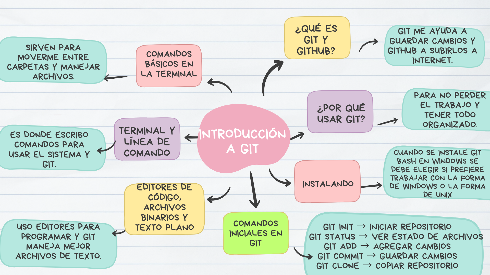
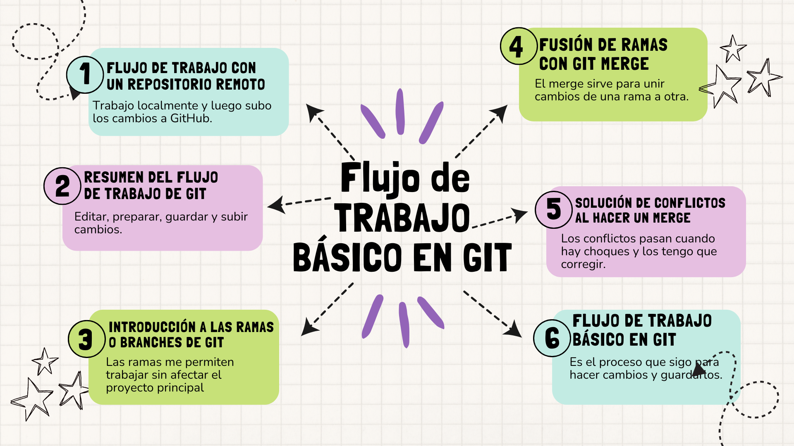
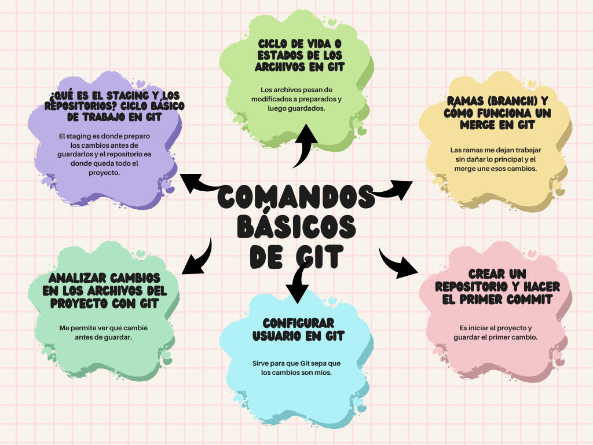

# 📚 Mapas Mentales

Colección de mapas mentales educativos para aprender y entender conceptos fundamentales de tecnología de forma visual e interactiva.

## 📖 Contenido

Este repositorio contiene mapas mentales sobre **Git y GitHub**, herramientas esenciales para el control de versiones y la colaboración en proyectos de desarrollo.

### Mapas Mentales

#### 1. 🎯 Introducción a Git

En este mapa explico lo básico para empezar a entender Git y GitHub.

- ¿Qué es Git y GitHub?

Git me ayuda a guardar cambios y GitHub a subirlos a internet.

- ¿Por qué usar Git?

Para no perder el trabajo.

Para tener todo organizado.

- Terminal y línea de comando

Es donde escribo comandos para usar el sistema y Git.

- Comandos básicos en la terminal

Sirven para moverme entre carpetas y manejar archivos.

- Editores de código, archivos binarios y texto plano

Usa editores para programar.

Git maneja mejor archivos de texto.

- Instalando

Cuando se instala Git Bash en Windows, se debe elegir si se prefiere trabajar con la forma de Windows o la forma de Unix.

- Comandos iniciales en Git

git init → Iniciar repositorio

git status → Ver estado de archivos

git add → Agregar cambios

git commit → Guardar cambios

git clone → Copiar repositorio

#### 2. 🔄 Flujo de Trabajo Básico

En este mapa explico cómo es el proceso básico que sigo cuando trabajo con Git.

- Flujo de trabajo con un repositorio remoto

Trabajo localmente y luego subo los cambios a GitHub.

- Resumen del flujo de trabajo de Git

Editar, preparar, guardar y subir cambios.

- Introducción a las ramas o branches de Git

Las ramas me permiten trabajar sin afectar el proyecto principal.

- Fusión de ramas con Git Merge

El merge sirve para unir cambios de una rama a otra.

- Solución de conflictos al hacer un merge

Los conflictos pasan cuando hay choques y los tengo que corregir.

- Flujo de trabajo básico en Git

Es el proceso que sigo para hacer cambios y guardarlos.

#### 3. ⚙️ Comandos Básicos de Git

- ¿Qué es el staging y los repositorios? Ciclo básico de trabajo en Git

El staging es donde preparo los cambios antes de guardarlos y el repositorio es donde queda todo el proyecto.

- Ciclo de vida o estados de los archivos en Git

Los archivos pasan de modificados a preparados y luego guardados.

- Ramas (branch) y cómo funciona un merge en Git

Las ramas me dejan trabajar sin dañar lo principal y el merge une esos cambios.

- Crear un repositorio y hacer el primer commit

Es iniciar el proyecto y guardar el primer cambio.

- Configurar usuario en Git

Sirve para que Git sepa que los cambios son míos.

 - Analizar cambios en los archivos del proyecto con Git

Me permite ver qué cambié antes de guardar.

#### 4. 🌐 Trabajo con Remotos en GitHub

En este mapa explico cómo trabajar con GitHub y repositorios remotos.

- Uso de GitHub

GitHub permite almacenar repositorios Git en la nube y colaborar mediante push, pull y forks.

- Configuración de llaves SSH

Consiste en generar y registrar llaves SSH para conectarse a GitHub sin contraseña.

- Llaves públicas y privadas

Las llaves SSH permiten autenticarse de forma segura usando una llave pública y una privada.

- Tags y versiones

Los tags marcan versiones importantes del proyecto en Git y GitHub.

- Árbol en Git

Muestra el historial del proyecto con commits, ramas y fusiones.

## 🎓 ¿Cómo Usar estos Mapas Mentales?

1. **Para aprender**: Comienza con "Introducción a Git" para entender los conceptos fundamentales
2. **Para referencia rápida**: Utiliza "Comandos Básicos de Git" mientras trabajas
3. **Para entender el flujo**: Revisa "Flujo de Trabajo Básico" para comprender el proceso completo
4. **Para colaborar**: Estudia "Trabajo con Remotos en GitHub" antes de trabajar en equipo

